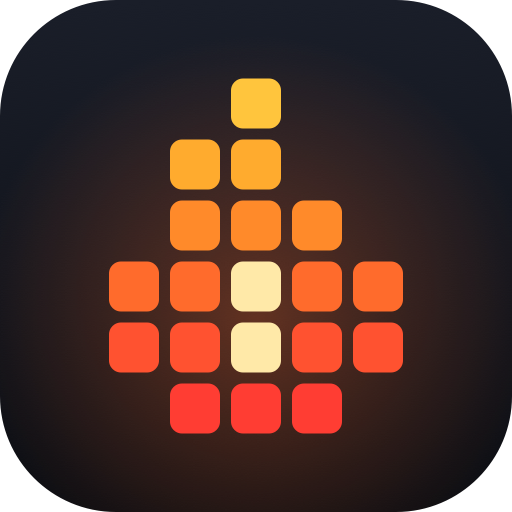

<p align="center"></p>

# ByteStreak

**One byte a day. Keep the streak alive.**

ByteStreak is a small internal learning game for developers. One short technical challenge goes live every working day. You answer it, see straight away whether you were right and why, earn XP, keep a streak going, unlock badges and climb a weekly team leaderboard.

Built with Laravel 13, Vue 3 + Inertia 3, Tailwind 4 and MySQL.

## Run it locally

```bash
composer install
npm install
cp .env.example .env        # then set DB_DATABASE / DB_USERNAME / DB_PASSWORD
php artisan key:generate
php artisan migrate --seed  # categories, badges, 59 starter challenges, one admin
npm run build               # or `npm run dev` while working on the front end
php artisan serve           # http://localhost:8000
```

Optional, for a lively demo (12 made-up teammates with three weeks of history):

```bash
php artisan db:seed --class=DemoSeeder
```

To wipe everything and start clean:

```bash
php artisan migrate:fresh --seed
```

### Signing in

`php artisan db:seed` creates one admin account from `SEED_ADMIN_NAME`, `SEED_ADMIN_EMAIL` and `SEED_ADMIN_PASSWORD` in `.env`. The demo teammates use the same password, with `firstname@demo.bytestreak.test` addresses.

In the `local` environment the login page also shows one-click sign-in buttons for the top accounts, so you never need to type a password while developing. That route does not exist in any other environment, and `BYTESTREAK_DEV_LOGIN=false` switches it off locally too.

Anyone can register at `/register`. Set `BYTESTREAK_ALLOWED_DOMAIN=yourcompany.com` to limit sign-up to one email domain. New accounts are plain developers; an admin promotes others under **Admin → Team**.

### The daily publish

```bash
php artisan challenges:publish-daily   # scheduled for 00:01 every day
```

On a server, add the usual single cron entry: `* * * * * php artisan schedule:run`. Locally you do not need it: the first visit of the day publishes the challenge if the scheduler has not.

### Tests

```bash
php artisan test
```

Tests run on in-memory SQLite and cover the game rules (XP, streaks, freezes, badges), daily publishing and the admin challenge flow.

## How the game works

All the numbers live in `config/bytestreak.php`.

| Rule | Default |
|---|---|
| XP for a correct answer | Easy 10 · Medium 20 · Hard 30 (each challenge stores its own value) |
| Wrong answer on the daily challenge | 2 XP for showing up |
| Streak bonus | +1 XP per streak day after the first, up to +10 |
| Archive / bonus challenges | Half XP, only when correct, and the streak is not affected |
| Streak | Counts every published daily challenge you answer, right or wrong |
| Rest days | A day with no challenge (weekends by default) never breaks a streak |
| Streak freeze | Earned every 7 days in a row, hold up to 2, each covers one missed day |
| Levels | Level L needs 25 × (L − 1) × L total XP: 50, 150, 300, 500, 750, 1050 … |
| Weekly leaderboard | XP earned since Monday; resets every week; opt out in your profile |

Each challenge can be answered once. The correct answer, the explanation and how the team answered stay on the server until you have locked in your own answer.

### Challenge life cycle

| Status | Meaning |
|---|---|
| `draft` | Work in progress, invisible to developers |
| `scheduled` with a date | Becomes the daily challenge on that date |
| `scheduled` without a date | In the queue: published on the next working day that has nothing scheduled |
| `published` with a date | Was (or is) the daily challenge for that date |
| `published` without a date | A bonus challenge that only lives in the archive |
| `archived` | Hidden from developers; answers and XP are kept |

Only one challenge can own a date. Set `BYTESTREAK_WEEKENDS=true` to draw from the queue on Saturdays and Sundays too.

## Where things are

```
app/Services/AttemptService.php         an answer becomes XP, streak and badges (one transaction)
app/Services/StreakService.php          streak and freeze rules
app/Services/DailyChallengeService.php  which challenge is "today's"
app/Services/BadgeService.php           badge criteria, progress and awarding
app/Services/LeaderboardService.php     weekly and all-time rankings
app/Services/ProgressService.php        dashboard / profile statistics
app/Services/Level.php                  XP → level maths
app/Http/Controllers/                   developer pages
app/Http/Controllers/Admin/             admin area (challenges, categories, badges, team)
database/seeders/data/challenges.php    the starter question bank
resources/js/pages/                     Inertia pages (Vue)
resources/js/components/                shared UI components
resources/css/app.css                   design tokens (dark + light themes) and component classes
```

## Admin area

Admins get an **Admin** link in the sidebar:

- **Overview**: today's participation, team accuracy, the next ten days (including which queued challenge will be picked), the hardest challenges and accuracy by topic.
- **Challenges**: create, edit, schedule, queue, publish now, archive, delete, plus per-challenge answer statistics.
- **Categories** and **Badges**: add, edit, hide.
- **Team**: who is playing, and who is an admin.

## Ideas for later

Timed challenges, team-vs-team weeks, Slack reminders, question import/export, and AI-assisted question drafts are all natural next steps. None of them are built yet.
